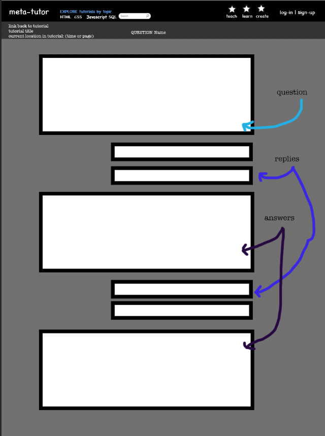

A question-answer site for tutorials.
To set up: 
in terminal
1) rails db:create
2) rails db:migrate
(stop and sign up three times, to create 3 different users)
4) rails db:seed

(in progress)
https://maiya-22.github.io/portfolio/projects.html

create 
